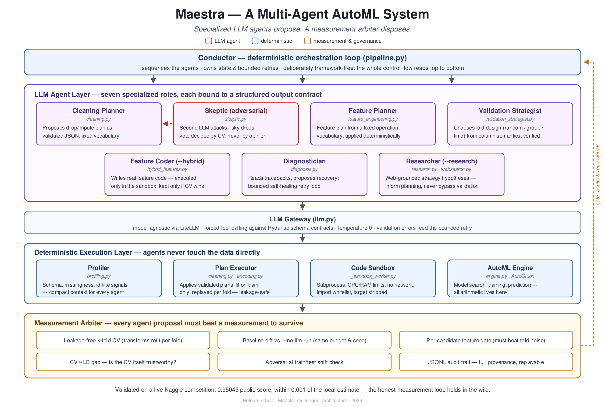

# Architecture

Maestra is a verification layer over AutoML, not an agent framework. This document explains the
one structural choice everything else follows from: **a linear loop, one measurement primitive,
and a strict separation between deciding, validating, executing, and judging** — and why that
shape was chosen over the more common multi-agent-framework alternative.



## The linear loop

There is exactly one control-flow entry point: [`pipeline.py::run_pipeline()`](../src/maestra/pipeline.py).
It is a plain Python function — a sequence of steps, top to bottom, no event loop, no message
passing, no agent-to-agent handoff:

```
profile → propose (cleaning / features / fold strategy / target framing) →
fit + measure (leakage-free CV) → accept or reject each proposal →
final fit → submission / report
```

Every step is a normal function call; every intermediate value is a normal Python object you can
print, log, or assert on. If you want to know why a run produced the number it did, you read
`pipeline.py` from the top — there is no orchestration layer to reconstruct first.

## Three planes, strictly separated

| Plane | What lives here | What it may do |
|---|---|---|
| **Decision** (LLM agents) | Validation Strategist, cleaning, feature engineering, Skeptic, target framing, diagnosis | *Propose* a structured JSON plan from a fixed vocabulary. Never touches data, never computes a metric. |
| **Execution** (the engine) | `engine.py` (AutoGluon, `Engine` protocol), `cleaning.py`/`feature_engineering.py` fit/transform | Fits proposals to data and produces predictions. Has no opinion on whether a proposal was good. |
| **Validation** (the CV layer) | `validation.py` — leakage-free k-fold CV, adversarial validation | Produces the honest measurement everything else is judged against. Re-fits every transform per fold; never leaks train-only statistics into validation rows. |
| **Arbitration** (the gate) | `intervention.py`, `validation.py::paired_delta_test`/`improves_beyond_noise` | Decides accept/reject from measured deltas. The only place a "yes" or "no" is produced. |

The rule this enforces: an LLM's output is data, not a verdict, until it has passed through the
Validation and Arbitration planes. Swapping cleaning.py's LLM-backed proposal for a hand-written
one changes what enters the pipeline, not how it's judged — the same gate applies either way.

## One measurement primitive: `intervention.py`

Every judgment agent in Maestra ends the same way: a proposal becomes an *intervention* (keep a
column, add a generated feature, reframe the target), and the intervention is adopted only if a
paired counterfactual — trial CV vs. the current base CV, on **identical folds** — clears
`improves_beyond_noise` (a Nadeau-Bengio-corrected paired test, see `docs/RESULTS.md`'s N1).

Before `intervention.py` existed, this loop was implemented three times (the Skeptic's veto, the
generated-feature gate, target framing), each slightly different. It now exists once, with two
properties the duplicated versions lacked:

- **A built-in counterfactual record.** Every outcome carries the per-fold base and trial scores,
  so any accepted *or rejected* intervention is auditable from the run log alone — not just that
  a decision was made, but exactly what was compared and by how much it moved. This is what
  powers the HTML dossier's "rejected interventions shown at equal footing" requirement (P1):
  a `target:log1p` rejection is not a gap in the report, it's a row in the same table as an
  acceptance.
- **A first-class cost budget** (`CVBudget`). Trial CVs are the multiplier that makes intervention
  loops expensive — each is a full k-fold AutoGluon run. The budget caps how many trials a run
  may spend across *every* gate; a trial that finds the budget exhausted is recorded as skipped,
  never silently dropped.

This is also why `compare()` (P3) reuses `paired_delta_test` directly rather than re-implementing
comparison logic: the arbiter is one piece of code, used everywhere a "does X measurably beat Y"
question is asked — inside the pipeline, and as a standalone public API.

## Why no agent framework

The alternative — LangGraph, CrewAI, an actor/message-passing runtime — buys flexibility Maestra
doesn't need and costs three things it does:

- **Auditability.** A run's full decision trail (what was proposed, measured, accepted, rejected,
  and why) needs to reconstruct from a linear log, not from replaying a graph's execution state.
  The HTML dossier and `docs/RESULTS.md` both depend on this being simple.
- **Debuggability.** A bug in a five-node agent graph requires understanding the graph's control
  flow *and* the bug. A bug in a 40-line Python function requires understanding the bug.
- **Topology that matches the actual problem.** Every "agent" in Maestra is a single structured
  LLM call that returns once — there is no multi-turn negotiation, no agent-to-agent dialogue, no
  dynamic routing decision that a graph engine would express more naturally than an `if` statement.
  Adding a framework here would model a topology more complex than the one that exists.

This is a deliberate trade against generality: Maestra's problem (propose → measure → decide) is
linear by nature, so a linear implementation is not a simplification made for expedience — it's
the correct shape for what the system actually does. The moment a genuinely non-linear
control flow is needed (parallel exploratory branches judged against each other, say), that
would be a real signal to revisit this choice — not a default to reach for early.

## Where this shows up in the code

- [`pipeline.py`](../src/maestra/pipeline.py) — the loop itself; `run_pipeline()`'s single
  holdout path and `_run_with_cv()`'s CV path share the same propose→measure→decide shape.
- [`intervention.py`](../src/maestra/intervention.py) — the one gate; `run_counterfactual()` is
  the function every accept/reject decision in the codebase eventually calls.
- [`validation.py`](../src/maestra/validation.py) — the honest measurement every gate reads;
  `cross_validate()`'s `engine` parameter (P3) makes the fitting step itself pluggable without
  touching the gate or the loop above it.
- [`engine.py`](../src/maestra/engine.py) — the `Engine` protocol: `AutoGluonEngine` (the
  pipeline's own path, unchanged), `SklearnEngine`/`LightGBMEngine` (for `compare()` and future
  lightweight gates). Adding an engine never changes what "measurably better" means.
- [`mcp_server.py`](../src/maestra/mcp_server.py) — the same three planes, exposed as tools
  instead of CLI flags: `audit_csv`/`check_validation`/`feasibility` each call straight into the
  Validation/Arbitration planes and return a verdict record, never a model.
